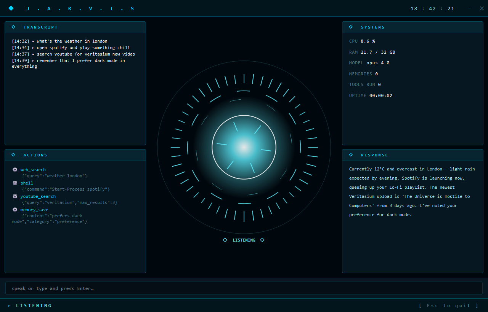

# J.A.R.V.I.S

A local, voice-driven personal assistant with a holographic HUD — powered by Claude,
with agentic control over your machine and a perpetual memory that recognises you
across sessions.

Speak to it, it speaks back. It can run shell commands, control apps, browse and
scrape the web, manage your to-dos, track your DSA grind and interview prep, and
remember everything in a diary that becomes its long-term context.

> Cross-platform (macOS + Windows). Built for a Mac Mini, developed on Windows.



## Features

- **Voice in, voice out** — speech-to-text (Google) + natural TTS (edge-tts). Falls back to a text box if no mic.
- **Claude brain** — agentic tool-use loop on `claude-opus-4-8` with adaptive thinking.
- **Machine control** — shell (PowerShell/zsh), launch apps, mouse/keyboard, screenshots; **AppleScript** on macOS for deep app control.
- **Web** — search, fetch & read pages, scrape YouTube (incl. transcripts) and Instagram profiles.
- **Two memories** — a curated long-term store *and* a perpetual **diary** fed back into context so Jarvis remembers you between restarts.
- **Live HUD** — arc-reactor interface with a **MAIN** view (transcript, actions, to-do, response) and a **JOB PREP** view (DSA tracker + SWE/MLE interview checklist).
- **Guarded autonomy** — acts freely on safe/read-only actions, confirms before anything destructive.

## The two views

- **MAIN** — the everyday assistant: live transcript, action log, your to-do list, and Jarvis's response, around a central arc reactor that reacts to its state (listening / thinking / speaking).
- **JOB PREP** (`Ctrl+2`) — a focused dashboard: a DSA problem tracker (easy/medium/hard solved counts) on the left, and a categorised SWE/MLE interview-prep checklist with progress bars on the right.

## Requirements

- Python 3.12+
- An [Anthropic API key](https://console.anthropic.com/settings/keys)
- A microphone (optional — text input works without one)

## Setup

### macOS (primary target)

```bash
# 1. System dependencies
brew install python portaudio          # portaudio is required for the mic (PyAudio)

# 2. Clone & install
git clone https://github.com/devansh-cmd/j.a.r.v.is.git ~/jarvis
cd ~/jarvis
pip3 install -r requirements.txt

# 3. API key
cp .env.example .env
nano .env                              # paste your ANTHROPIC_API_KEY

# 4. Activate the secret-guard git hook
git config core.hooksPath scripts/git-hooks

# 5. Run
python3 jarvis_hud.py                  # graphical HUD
# or: python3 jarvis.py               # plain terminal version
```

**Grant macOS permissions** (System Settings → Privacy & Security) — without these,
the control tools silently fail. Add your terminal (or the Python app) to:

| Permission | Enables |
| ---------- | ------- |
| **Microphone** | voice input |
| **Accessibility** | mouse & keyboard control |
| **Screen Recording** | screenshots |
| **Automation** | controlling other apps via AppleScript |
| **Full Disk Access** *(optional)* | touching protected folders (Desktop, Documents, Mail…) |

### Windows

```powershell
git clone https://github.com/devansh-cmd/j.a.r.v.is.git C:\Jarvis
cd C:\Jarvis
pip install -r requirements.txt
Copy-Item .env.example .env            # then edit .env with your key
git config core.hooksPath scripts/git-hooks
python jarvis_hud.py
```

## Usage

- Just talk — or type in the bottom box and press Enter.
- `Ctrl+1` / `Ctrl+2` switch MAIN ↔ JOB PREP. Drag the title bar to move. **Esc** quits.
- Try: *"what's on my to-do"*, *"I solved Two Sum, easy"*, *"open Safari and search for…"*, *"remember that I prefer dark mode"*.

## How memory works

- **Diary** (`diary/`) — every turn (your words, each tool call, Jarvis's reply) is journaled to JSONL + a daily Markdown log. Recent diary is injected into Jarvis's context each session, so it picks up where you left off. This is its perpetual memory.
- **Curated memory** (`memory_store/memories.json`) — durable facts Jarvis chooses to save with `memory_save` (your name, preferences, projects), searchable any time.

Both directories are gitignored — your data never leaves your machine.

## Configuration

Edit [`config.py`](config.py): model, TTS voice/rate, shell timeout, listen window,
and the persona. The persona and shell adapt to your OS automatically.

## Security

No secrets are hardcoded; the API key is read only from your local (gitignored)
`.env`. A pre-commit hook blocks accidental key commits. See [SECURITY.md](SECURITY.md).

## Project structure

```
jarvis_hud.py        # graphical entry point
jarvis.py            # terminal entry point
config.py            # settings + OS-aware persona
core/
  brain.py           # Claude agentic loop + memory injection
  tools.py           # all tools (shell, web, apps, trackers, memory…)
  voice.py           # STT + TTS
  memory.py          # curated long-term memory
  diary.py           # perpetual diary (write + read-back)
  tasks.py dsa.py prep.py   # the trackers
hud/                 # PySide6 HUD (window, widgets, reactor, worker, style)
```

## Roadmap

- ElevenLabs British-Jarvis voice
- Visual polish pass on the HUD (glow, scan-line, richer reactor)
- Recommended MCP integrations
- Rolling diary summarisation for long-term scale
